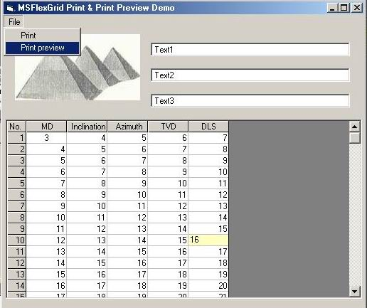



## Msflexgrid Preview \(ver\. 2\)

### Description

This is the second version of Msflexgrid preview,it has powerfull functions such as printing and adding your logo,textbox data and good look.

please check it and tell me your Opinon
 
### More Info
 

             |
---                |---
**Submitted On**   |2004-08-24 21:59:02
**By**             |[Khaled Agwa](https://github.com/Planet-Source-Code/PSCIndex/blob/master/ByAuthor/khaled-agwa.md)
**Level**          |Intermediate
**User Rating**    |4.8 (43 globes from 9 users)
**Compatibility**  |VB 5\.0, VB 6\.0
**Category**       |[VB function enhancement](https://github.com/Planet-Source-Code/PSCIndex/blob/master/ByCategory/vb-function-enhancement__1-25.md)
**World**          |[Visual Basic](https://github.com/Planet-Source-Code/PSCIndex/blob/master/ByWorld/visual-basic.md)
**Archive File**   |[Msflexgrid1785518242004\.zip](https://github.com/Planet-Source-Code/khaled-agwa-msflexgrid-preview-ver-2__1-55799/archive/master.zip)

